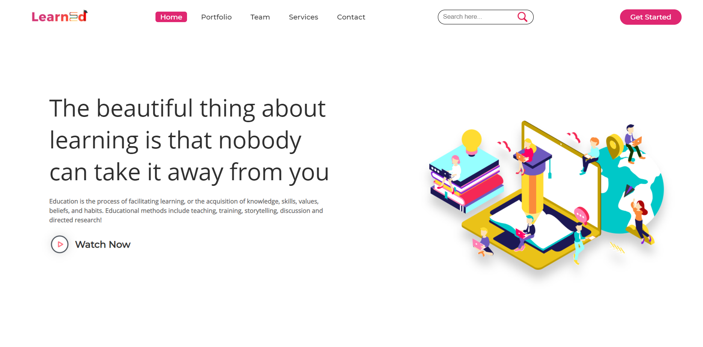

## LearnScape (E-learning Website)
An educational website for students and programmers 😊😊😊  

Try this out::  

Our Educational Website would provide all the education related stuffs:  
Notes, Online Video Lectures and courses to crack competitive  
exams like Page1-Main, Page1-Advanced, Page2, etc. Students can clear their doubts  
by sending their questions to our website. We have added Quizzes for Students  
who are willing to solve problems on different topics. We have also added  
Interview questions for students who are preparing for placements.  
  
✔ We have made this website as responsive website so, students or users can  
   easily access our website from  any device.  
✔ Quiz Section is an interesting feature for students which provide them with  
   lots of questions. They can view their scores easily and solutions of every questions.  
✔ Chatting – in this I have added a project section where students and peers  
   can talk to each other, share resources with each other, challenge each other. 
✔ Video Calls and Voice calls - a P2P model as this project is helps students get connected 
   with each other, have meaningful meetings, have conferences and much more exciting stuff. 
   
It is completely responsive website, to provide smooth experience...😎 
Its a completely communinty driven and supported by only Students and students only which creates 
strong and intimate trust among peers.
If you like my project, give it a star  😁😁😁
